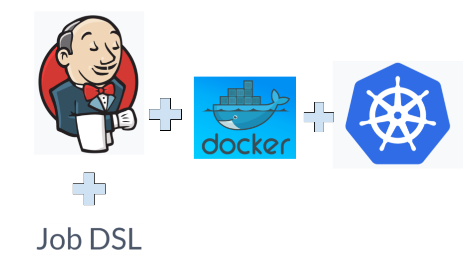
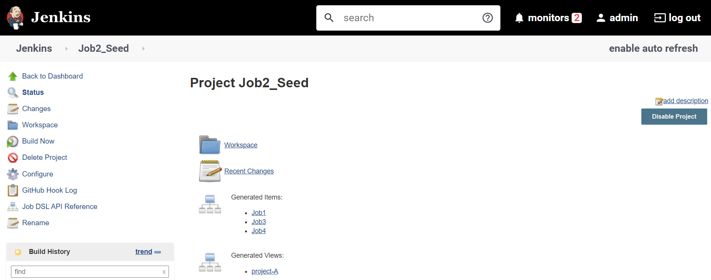
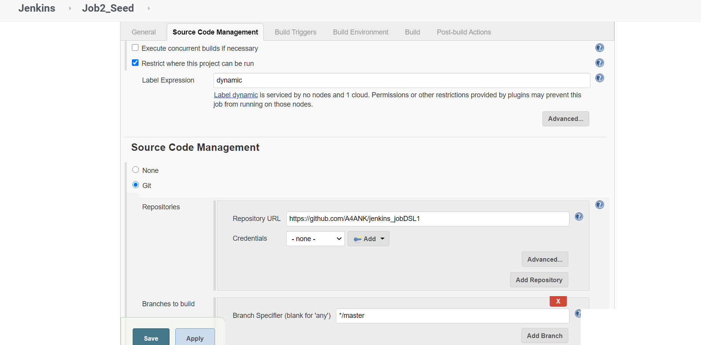
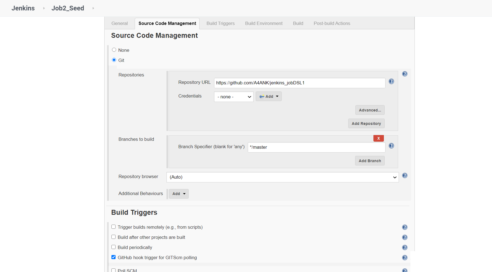
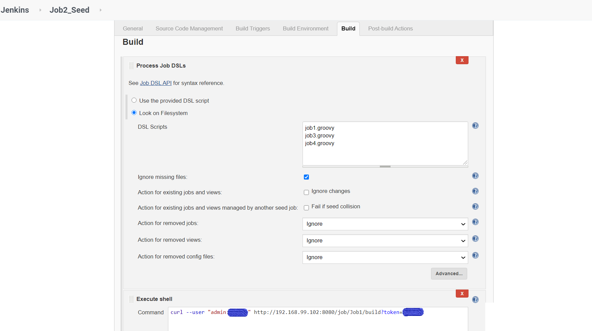
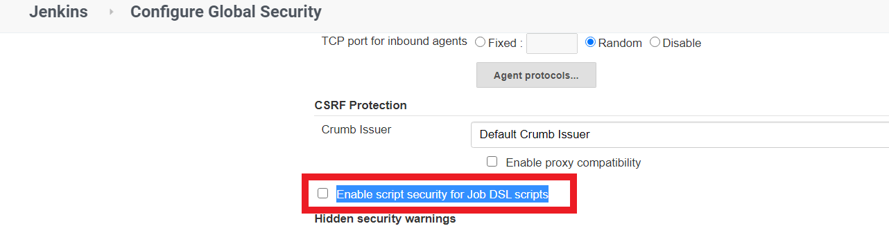
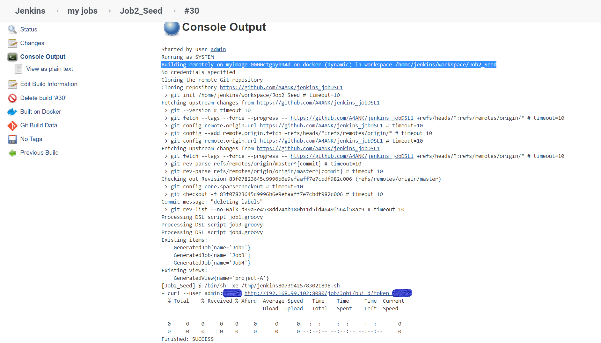
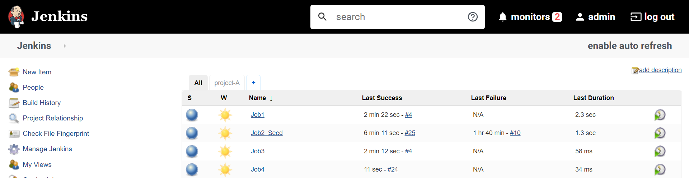
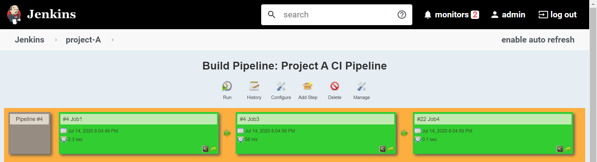
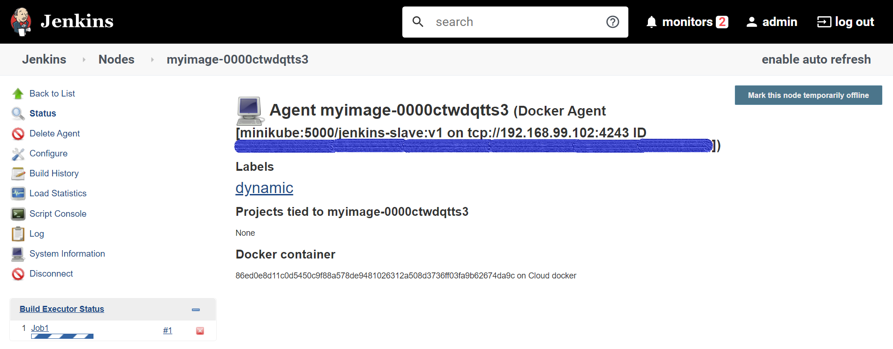

# Jenkins Jobs from groovy files (JobDSL plugin) on Dynamic Jenkins cloud nodes[Docker]



### Deploying a httpd application on the K8s having PVCs, PVs, Services(NodePort), and NFS-Dynamic centralized storage provisioner.
The Job DSL plugin attempts to solve this problem by allowing jobs to be defined in a programmatic form in a human-readable file. Writing such a file is feasible without being a Jenkins expert as the configuration from the web UI translates intuitively into code.

https://plugins.jenkins.io/job-dsl/

## Prerequisites:-
A pre-installed K8s cluster(e.g. minikube). In minikube by default, there is no
internal NFS dynamic provisioner is available for the storage class so it can claim a PVC or PV dynamically. so we are creating a NFS-client dynamic provisioner in the K8s cluster using a service account, cluster roles, etc., which basically uses RBAC (role-based access controls) Authorization.
follow this repo for creating NFS-client dynamic provisioner in the K8s cluster using a service account, cluster roles, etc.

https://kubernetes.io/docs/tasks/configure-pod-container/configure-service-account/

https://kubernetes.io/docs/reference/access-authn-authz/rbac/

Also, install Github, Build Pipeline Plugin in Jenkins.
For creating cloud nodes using Docker(install Docker plugin in Jenkins)
then create a DOCKER_HOST (install docker, start and enable its services).
For creating private docker registry, follow my article
And for creating Integration of K8s, GitHub, and Jenkins Dynamic Slaves
follow my article
Tasks to be created:-
1. Deploy httpd as pods on top of K8s by creating resources Deployment, ReplicaSet, Pods, and Services ,etc. using Jenkins Jobs DSL running on Jenkins Dynamic Slaves.
2. And make their data to be remain persistent using persistent volume claims and persistent volumes.
3. And it should be exposed to outside world using Services.

### Solutions:-
The jobs we used for creating new jobs are called Seed Jobs and this seed job generates new jobs using Jenkins files (using JobDSL plugin).



### Seed Job:-
Creating a Seed job by the admin.







Running a job from the groovy script prompt for allowing/denying the job and waits until the admin is not manually responding to this prompt.
Here, we disabling this feature (Enable script security for Job DSL scripts)
Jenkins Dashboard→ Manage Jenkins → Configure Global Security



JobDSL scripts for generating new jobs.

### Job1.groovy
```
job("Job1"){
    description("First job")
    authenticationToken('secret')
    label('dynamic')
    scm {
        github('A4ANK/jenkins_jobDSL1', 'master')
    }
    triggers {
        gitHubPushTrigger()   
    }
    steps {
        shell ('''
cp -rf * /storage/
if  kubectl get pvc httpd-pvc
then
 echo "PVC & PV already created, applying latest changes and copying the webpage"
     kubectl apply -f /storage/httpd-pvc.yml
    x=$( find /storage -name '*httpd-pvc-pvc*')
      cp -rf /storage/index.html  $x
else
  kubectl apply -f /storage/httpd-pvc.yml
     sleep 5
    x=$( find /storage -name '*httpd-pvc-pvc*')
      cp -rf /storage/index.html  $x
    echo "Creating pvc and copying the webpage"
fi
if  kubectl get svc httpd-service
then
 echo "service already created and applying latest changes"
     kubectl apply -f /storage/httpd-svc.yml
else
  kubectl apply -f /storage/httpd-svc.yml
    echo "Creating service"
fi 
 
if  kubectl get deploy httpd-webapp
then
 echo "Deployment already created and applying latest changes"
     kubectl apply -f /storage/httpd-deployment.yml
else
  kubectl apply -f /storage/httpd-deployment.yml
    echo "Creating Deployment"
fi
        ''')
    }
}
buildPipelineView('project-A') {
    title('Project A CI Pipeline')
    displayedBuilds(5)
    selectedJob('Job1')
    showPipelineParameters()
    refreshFrequency(60)
}
```
### Job3.groovy
```
job("Job3"){
    description("Third job")
    triggers {
            upstream('Job1', 'SUCCESS')
    }
    steps {
        shell ('''
statuscode=$(curl -s -o /dev/null -w "%{http_code}" 192.168.99.101:31000/index.html)
if [ $statuscode == '200' ]
then
 echo "Webpage tested successfully"
    exit 0
else
 echo "Error code $statuscode"
    exit 1
fi
        ''')
    }
}
```

### Job4.groovy
```
job("Job4"){
    description("Fourth job")
    triggers {
            upstream('Job3', 'SUCCESS')
            cron('* * * * *')
    }
    steps {
        shell ('''
if [ $(curl -s -o /dev/null -w "%{http_code}" 192.168.99.101:31000/index.html) == '200' ]
then
 echo "Webpage tested successfully"
    exit 0
else
 echo "Error code $statuscode"
    echo "triggering the job2 for creating resources for the deployment and mailing to the dev"
    sudo python3  /storage/mail_script.py
    curl --user "admin:<password>" http://192.168.99.102:8080/job/Job1/build?token=secret
    exit 0
fi
        ''')
    }
}
```

### Now admin can start building this SeedJob.


So now we have generated required jobs using Jenkins JobDSL scripts and also build pipeline view.



### Also, we are using labels to restrict the generated jobs to be build on the Docker cloud nodes.


### Here we can see our data is persistent and K8s resources are running using kubectl client command.
```
[root@server ~]# ls /storage/
default-httpd-pvc-pvc-62f4ef1a-6e7c-4bd0-aeed-e83f946d7501
[root@server ~]# ls /storage/default-httpd-pvc-pvc-62f4ef1a-6e7c-4bd0-aeed-e83f946d7501/
index.html
[root@server ~]# kubectl get pvc
NAME        STATUS   VOLUME                                     CAPACITY   ACCESS MODES   STORAGECLASS       AGE
httpd-pvc   Bound    pvc-62f4ef1a-6e7c-4bd0-aeed-e83f946d7501   200Mi      RWO            nfs-storageclass   153m
[root@server ~]# kubectl get svc
NAME            TYPE        CLUSTER-IP       EXTERNAL-IP   PORT(S)        AGE
httpd-service   NodePort    10.102.154.132   <none>        80:31000/TCP   153m
kubernetes      ClusterIP   10.96.0.1        <none>        443/TCP        22d
[root@server ~]# kubectl get pods
NAME                                                  READY   STATUS    RESTARTS   AGE
httpd-webapp-c8d799675-l6vtc                          1/1     Running   0          153m
```
For Jenkins Job DSL documentation:-
Follow https://jenkinsci.github.io/job-dsl-plugin/

P.S.- Any questions or suggestions are welcome.
